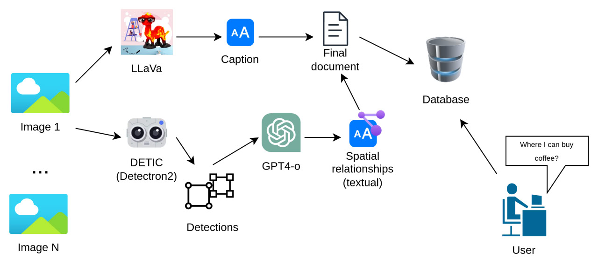

# genai_navirag
Navigation RAG project for Generative AI course. 

The key idea is to employ RAG approach to interact with the visual topological graphs.




## Prerequisites
Create a `conda` environment that will be used in the project:
```shell
conda create --name navirag python=3.10
conda activate navirag
```
Install the required third-party repositories, namely [LLaVa](https://github.com/haotian-liu/LLaVA), [Detic](https://github.com/facebookresearch/Detic), [SAM](https://github.com/facebookresearch/segment-anything), using script:
```shell
./install_prerequisites.sh
```
Finally, install rest of the project-specific dependenices:
```shell
pip3 install -r requirements.txt
```

## Executables

Dataset preparation:
- [dataset_prep.ipynb](notebooks/dataset_prep.ipynb)
- [prepare_data.ipynb](notebooks/prepare_data.ipynb)

Inference:
- [rag_multiple.ipynb](notebooks/rag_multiple.ipynb)
- [rag_oop.ipynb](notebooks/rag_oop.ipynb)
